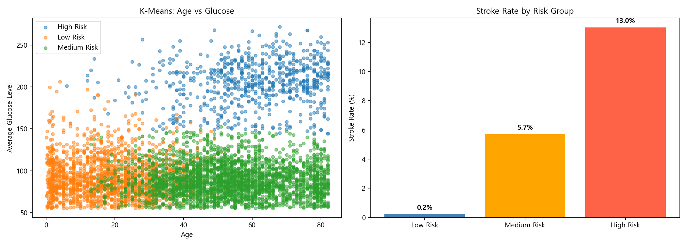
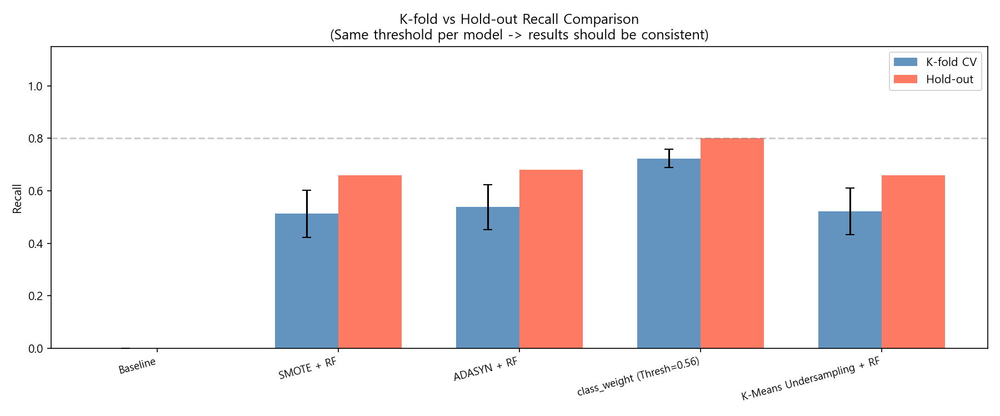
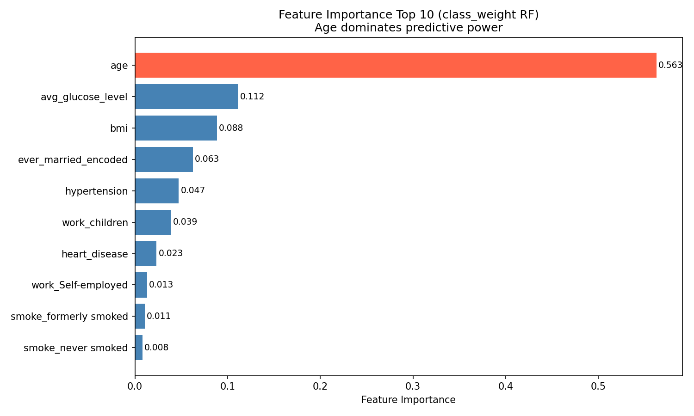

# Stroke Risk Prediction

뇌졸중 환자가 전체의 4.9%뿐인 불균형 의료 데이터에서 **Recall을 최우선 지표**로 삼아 5가지 불균형 처리 기법을 비교하고, K-Means로 위험군을 프로파일링한 프로젝트이다. 데이터과학 수업 Term Project(2026.06)로 진행한 3인 팀 프로젝트이다.

- 데이터: [Stroke Prediction Dataset (Kaggle)](https://www.kaggle.com/datasets/fedesoriano/stroke-prediction-dataset), 5,110건, 12개 피처
- 스택: Python, pandas, scikit-learn, imbalanced-learn, Plotly

## 문제 정의

의료 진단에서는 환자를 놓치는 오류(False Negative)가 오진(False Positive)보다 훨씬 치명적이다. 이 데이터는 환자 비율이 4.9%뿐이라 모델이 전부 "정상"이라고 예측해도 Accuracy가 95%가 나온다. 그래서 Accuracy 대신 Recall을 최우선 지표로 정하고, 불균형을 다루는 기법 5가지를 같은 조건에서 비교했다.

## 내 역할

3인 팀 프로젝트이며 기여도는 30%이다.

- 전처리부터 모델링까지 코드 구현에 참여하고, 코드 설명 보고서를 작성했다.
- 수업 범위를 넘는 추가 구현을 제안하고 구현했다: Silhouette Score 검증, Plotly 3D 인터랙티브 산점도, 소수 클래스 가중치(class_weight), 결정 임계값 튜닝, Feature Importance 시각화

## 접근 방법

1. **전처리** (`notebooks/1_scaling_encoding.ipynb`): 결측 BMI는 평균으로 대체하고, `gender=Other` 1건을 제거했다. 이진 변수는 Label, 다범주 변수는 One-Hot 인코딩을 썼다. `stratify`로 80:20 분할해 환자 비율을 유지했고, StandardScaler는 분할 이후 train에만 fit해서 데이터 누수를 막았다.
2. **K-Means 군집화** (`notebooks/2_modeling.ipynb`): 나이, BMI, 평균 혈당으로 군집을 나눴다. Elbow Method로 k=3을 선택했고 Silhouette Score는 0.3719이다.
3. **Random Forest 5개 실험**: Baseline / SMOTE / ADASYN / class_weight / K-Means undersampling(정상군을 환자 수만큼의 군집 중심으로 압축)
4. **평가** (`notebooks/3_evaluate.ipynb`): Stratified 5-Fold와 Hold-out을 함께 썼다. 오버샘플링이 train fold 안에서만 일어나도록 `ImbPipeline`을 썼고, 결정 임계값은 5-fold OOF 확률로 모델별로 탐색했다.

## 결과

수치는 `3_evaluate.ipynb`의 실행 출력 기준이다.

### K-Means 위험군 (k=3, Silhouette 0.3719)

| 위험군 | 인원 | 뇌졸중 발생률 | 평균 나이 | 평균 혈당 |
|---|---|---|---|---|
| Low | 1,712 | 0.2% | 18.8 | 92.7 |
| Medium | 2,699 | 5.7% | 54.2 | 89.1 |
| High | 698 | 13.0% | 60.4 | 205.3 |

고위험군은 평균 혈당이 205.3으로 나머지 두 군집의 두 배 이상이고, 발생률은 저위험군의 60배 이상이다. 3D로 직접 돌려볼 수 있다: [kmeans_3d.html](https://nonmaju.github.io/stroke-risk-prediction/outputs/kmeans_3d.html)

### 분류 성능

| 기법 | 임계값 | K-fold Recall (평균 ± 표준편차) | Hold-out Accuracy | Precision | Recall | F1 |
|---|---|---|---|---|---|---|
| Baseline | 0.50 | 0.0000 ± 0.0000 | 0.9511 | 0.0000 | 0.0000 | 0.0000 |
| SMOTE + RF | 0.62 | 0.5124 ± 0.0895 | 0.7965 | 0.1473 | 0.6600 | 0.2409 |
| ADASYN + RF | 0.62 | 0.5378 ± 0.0852 | 0.7779 | 0.1388 | 0.6800 | 0.2305 |
| **class_weight + RF** | 0.56 | **0.7236 ± 0.0355** | 0.7681 | 0.1498 | **0.8000** | **0.2524** |
| K-Means undersampling + RF | 0.76 | 0.5222 ± 0.0892 | 0.7524 | 0.1227 | 0.6600 | 0.2069 |

- Baseline은 Accuracy 95%인데도 환자를 한 명도 찾지 못했다. Accuracy만 보면 가장 좋아 보이는 모델이 실제로는 쓸모가 없다.
- class_weight가 Recall과 F1이 모두 가장 높았고 fold 간 편차도 가장 작았다. 데이터를 합성하거나 줄이지 않고 손실 가중치만 조정한 방식이 가장 안정적이었다.
- 모든 기법에서 Precision은 0.12~0.15 수준으로 낮다. 환자를 놓치지 않는 대신 오탐이 늘어나는 트레이드오프이다.
- Feature Importance는 age > avg_glucose_level > bmi 순이며 K-Means 결과와 일치한다.

| K-Means 군집 | Recall 비교 | Feature Importance |
|---|---|---|
|  |  |  |

## 실행 방법

```bash
pip install -r requirements.txt
```

1. Kaggle에서 데이터를 내려받아 `data/healthcare-dataset-stroke-data.csv`로 저장한다. (데이터는 저장소에 포함하지 않았다.)
2. `notebooks/` 안의 노트북을 번호 순서대로 실행한다. 각 노트북은 자기 폴더(`notebooks/`)를 기준으로 경로를 읽으므로 Jupyter가 노트북 위치에서 실행되어야 한다.
   - `1_scaling_encoding.ipynb` → `outputs/processed_data.pkl` 생성
   - `2_modeling.ipynb` → `outputs/models.pkl`, 그래프, 3D 시각화 생성
   - `3_evaluate.ipynb` → 평가 그래프 생성

`outputs/`에 있는 그래프는 제출 당시의 결과물이다. `.pkl` 파일은 노트북을 실행하면 다시 만들어지므로 저장소에서 제외했다.

## 재현 참고

`requirements.txt`의 버전(Python 3.13)으로 노트북 3개를 처음부터 다시 실행해 제출 당시 결과와 비교했다. 제출 당시 실행 환경은 Python 3.9.13이었고 라이브러리 버전은 기록이 남아 있지 않다.

- **완전히 같은 결과**: Baseline, class_weight (K-fold Recall 0.7236, Hold-out Recall 0.8000, F1 0.2524)
- **소수점 단위로 달라지는 결과**: SMOTE, ADASYN, K-Means undersampling, K-Means 군집. 합성 데이터 생성과 군집화가 라이브러리 버전에 따라 달라지기 때문이다.

| 기법 | Hold-out Recall (제출 당시) | Hold-out Recall (재실행) |
|---|---|---|
| SMOTE + RF | 0.66 | 0.68 |
| ADASYN + RF | 0.68 | 0.70 |
| K-Means undersampling + RF (임계값) | 0.66 (0.76) | 0.54 (0.82) |

K-Means 군집의 Silhouette Score도 0.3719에서 0.3717로 달라졌지만 위험군별 뇌졸중 발생률(0.2% / 5.7% / 13.0%)은 같다. 어느 쪽에서도 class_weight가 Recall과 F1이 가장 높고 가장 안정적이라는 결론은 바뀌지 않는다.

## 구조

```
├─ notebooks/   전처리, 모델링, 평가 노트북 (제출 당시 실행 결과 포함)
├─ outputs/     그래프와 3D 시각화
├─ data/        데이터 저장 위치 (Kaggle에서 직접 내려받는다)
└─ requirements.txt
```

원본 제출본에서 바꾼 것은 로컬 절대경로를 상대경로로 고친 부분뿐이며, 모델링 코드와 실행 결과는 그대로이다.
